# 💍 Medidor de Anillos

> **"Desarrollo de una herramienta para la correcta dimensión de un anillo a través de una app"**

Aplicación web que encuentra la **talla de un anillo** con la pantalla del celular. No hay que ir a la joyería ni tener un medidor de anillos.
Se pone un anillo sobre la pantalla, o se mide el dedo con un hilo, y la app devuelve la talla (T1–T36), el diámetro en mm y la equivalencia USA.

**App en línea:** https://sneatx.github.io/medidor-anillos/

| Inicio | Medir con anillo | Resultado |
| :---: | :---: | :---: |
| 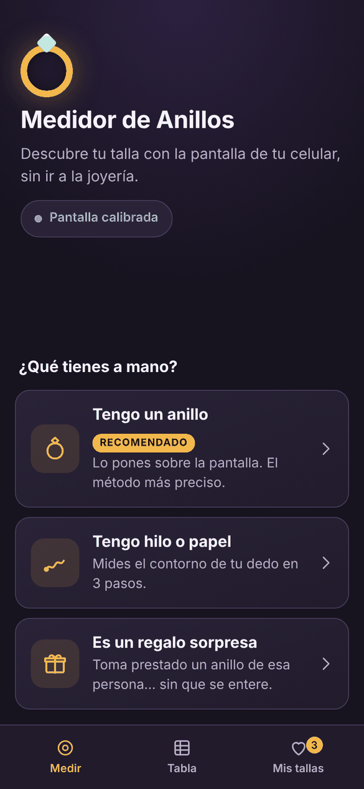 | 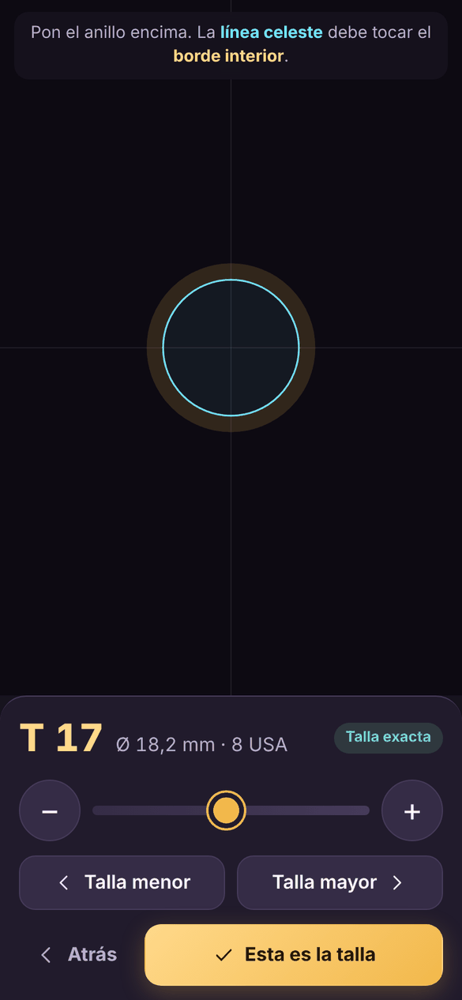 | 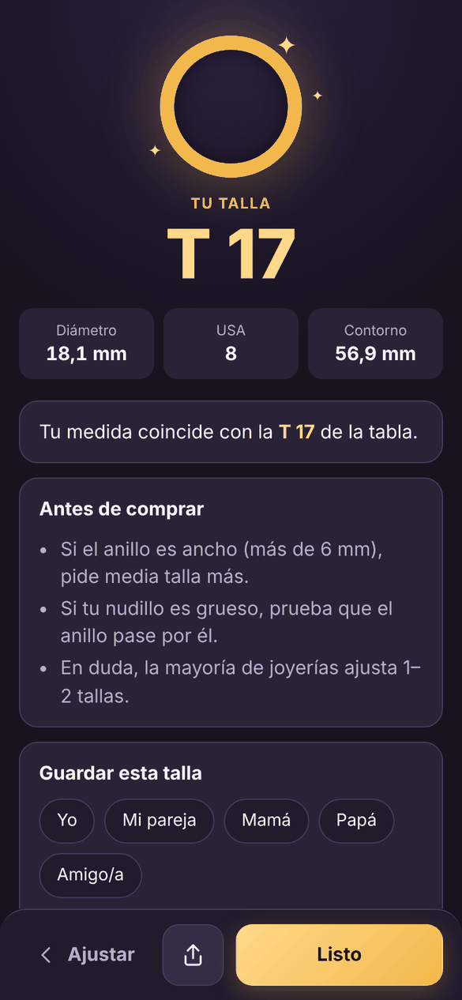 |

---

## Contenido

1. [Objetivo](#objetivo)
2. [Tecnologías y versiones](#tecnologías-y-versiones)
3. [Alcance](#alcance)
4. [Fase 1 · Levantamiento de requerimientos](#fase-1--levantamiento-de-requerimientos)
5. [Fase 2 · Análisis del sistema](#fase-2--análisis-del-sistema)
6. [Fase 3 · Construcción](#fase-3--construcción)
7. [Thumb Zone: dónde va cada elemento y por qué](#thumb-zone-dónde-va-cada-elemento-y-por-qué)
8. [Fase 4 · Pruebas](#fase-4--pruebas)
9. [Fase 5 · Documentación e instrucciones de uso](#fase-5--documentación-e-instrucciones-de-uso)
10. [Explicación de la herramienta funcional](#explicación-de-la-herramienta-funcional)
11. [Instalación y desarrollo](#instalación-y-desarrollo)

---

## Objetivo

Desarrollar una aplicación con **HTML, CSS, JavaScript y un framework (React)** que detecte el diámetro de un anillo, aplicando técnicas de Ingeniería de Software en cada etapa: requerimientos, análisis, implementación, pruebas y documentación. El diseño de la interfaz sigue el criterio de **Thumb Zone** (zona del pulgar).

## Tecnologías y versiones

| Capa | Tecnología | Versión |
| --- | --- | --- |
| Estructura | HTML5 (`index.html`, SVG en línea) | — |
| Estilos | CSS3 (variables, grid, flexbox, `dvh`, `env(safe-area-inset-*)`) | — |
| Lógica | JavaScript (ES2023, módulos) | — |
| **Framework** | **React** + React DOM | **19.3.0** |
| Empaquetador / servidor dev | Vite (+ `@vitejs/plugin-react` 6.1.2) | 8.3.3 |
| Pruebas | Vitest + Testing Library (React 16.3.3) + jsdom 29.1.1 | 5.0.3 |
| Linter | Oxlint | 1.87.0 |
| CI/CD | GitHub Actions → GitHub Pages | — |
| Entorno | Node.js | 22 |

No usa servidor ni base de datos: es una SPA estática. Los datos del usuario (calibración y tallas guardadas) se quedan en su propio dispositivo (`localStorage`).

## Alcance

La aplicación:

- ✅ Tiene una **lista de requerimientos funcionales y no funcionales** ([Fase 1](#fase-1--levantamiento-de-requerimientos)).
- ✅ **Muestra la thumb zone** y explica por qué cada elemento está donde está ([Thumb Zone](#thumb-zone-dónde-va-cada-elemento-y-por-qué)).
- ✅ Incluye la **explicación de la herramienta funcional** ([Explicación](#explicación-de-la-herramienta-funcional)).

**Fuera de alcance:** la medición por cámara o realidad aumentada (los navegadores no exponen la distancia real a la cámara) y las cuentas de usuario o la sincronización en la nube.

---

## Fase 1 · Levantamiento de requerimientos

### Técnicas aplicadas

| Técnica | Cómo se aplicó |
| --- | --- |
| **Análisis documental** | Se estudió la tabla *Tallas y equivalencias* (T1–T36, Ø mm, USA). Es la fuente de verdad de los datos. |
| **Personas y escenarios** | Se definieron 3 perfiles de usuario y sus contextos de uso (ver abajo). |
| **Historias de usuario** | Cada necesidad se escribió como *"Como… quiero… para…"* con criterios de aceptación. |
| **Benchmarking** | Se revisaron métodos tradicionales: el medidor de joyería (anillo cónico), la tira de papel y las tablas impresas. Así se identificaron sus problemas: impresión a escala incorrecta, confusión entre diámetro y circunferencia, y no saber qué hacer entre dos tallas. |
| **Prototipado iterativo** | Se hicieron prototipos navegables en un viewport móvil y se corrigieron con base en lo observado. Por ejemplo, la tarjeta de calibración tapaba los controles y se movió. |

### Personas

| Persona | Contexto | Necesidad |
| --- | --- | --- |
| **Laura, 27** – compra su propio anillo en línea | Celular en una mano, tiene un anillo que le queda bien | Saber su talla exacta en menos de 1 minuto |
| **Andrés, 31** – quiere comprar un anillo de compromiso | No puede preguntarle la talla a su pareja | Medir en secreto un anillo prestado y guardarlo |
| **Rosa, 58** – no tiene anillos de referencia | Poca experiencia con apps | Pasos claros, letras grandes, sin términos técnicos |

### Historias de usuario

| ID | Historia | Criterio de aceptación |
| --- | --- | --- |
| HU1 | Como usuario **quiero poner mi anillo sobre la pantalla** para saber su talla | El círculo en pantalla tiene el tamaño real y se muestra T, mm y USA |
| HU2 | Como usuario sin anillo **quiero medir mi dedo con un hilo** para saber mi talla | Al ingresar la circunferencia se calcula Ø = C/π y la talla |
| HU3 | Como comprador de un regalo **quiero medir en secreto y guardar la talla** | Existe un flujo "regalo" y se puede guardar con un nombre |
| HU4 | Como usuario **quiero saber qué talla elegir si quedo entre dos** | La app explica que está entre T*n* y T*n+1* y recomienda la mayor |
| HU5 | Como usuario **quiero convertir una talla a USA o mm** | Tabla completa con buscador por "T17", "18,1" u "8 usa" |
| HU6 | Como usuario **quiero usar la app con una sola mano** | Todos los controles están en la zona natural del pulgar |

### Requerimientos funcionales (RF)

| ID | Requerimiento | Prioridad |
| --- | --- | --- |
| RF01 | Calibrar la pantalla con una tarjeta estándar ISO/IEC 7810 ID‑1 (débito, crédito, cédula) | Alta |
| RF02 | Calibrar como alternativa con una regla (referencia de 5 cm) | Media |
| RF03 | Guardar la calibración e invalidarla si cambia la pantalla o el zoom | Alta |
| RF04 | Dibujar un círculo a escala real y ajustar su diámetro con botones −/+ (0,05 mm), con un slider y saltando de talla en talla | Alta |
| RF05 | Mostrar en vivo la talla T, el diámetro en mm y la talla USA mientras se ajusta | Alta |
| RF06 | Medir el dedo con tira o hilo: guía de 3 pasos, ingreso manual de la circunferencia y regla en pantalla | Alta |
| RF07 | Convertir la circunferencia en diámetro (Ø = C / π) | Alta |
| RF08 | Recomendar talla: exacta (±0,1 mm), entre dos tallas (se recomienda la mayor) o fuera de rango | Alta |
| RF09 | Pantalla de resultado con T, Ø, USA, contorno, explicación y consejos de compra | Alta |
| RF10 | Guardar tallas con nombre ("Yo", "Mamá"…), listarlas, eliminarlas (con deshacer) y compartirlas | Media |
| RF11 | Compartir la talla (Web Share API o copiar al portapapeles) | Media |
| RF12 | Tabla de equivalencias T1–T36 con buscador y vista del círculo a tamaño real | Media |
| RF13 | Flujo "Regalo sorpresa" con indicaciones específicas | Baja |
| RF14 | Avisar cuando se mide sin calibrar (resultado aproximado) | Alta |

### Requerimientos no funcionales (RNF)

| ID | Categoría | Requerimiento |
| --- | --- | --- |
| RNF01 | Usabilidad | Uso con una mano: los controles interactivos están en la *thumb zone* (mitad inferior) |
| RNF02 | Usabilidad | Objetivos táctiles de **≥ 44 px** (los principales, de 52 px) |
| RNF03 | Usabilidad | El flujo principal se completa en menos de 60 s. Desde el inicio y sin contar el ajuste, son 2 toques hasta el resultado |
| RNF04 | Precisión | Resolución de ajuste de 0,05 mm. La tabla avanza unos 0,3 mm por talla |
| RNF05 | Rendimiento | Carga inicial < 100 kB gzip y sin peticiones a servidores |
| RNF06 | Compatibilidad | Chrome, Safari, Firefox y Edge recientes. Funciona en celular y en PC |
| RNF07 | Accesibilidad | Etiquetas ARIA, `aria-live` en la lectura de talla, foco visible, contraste alto y respeto a `prefers-reduced-motion` |
| RNF08 | Privacidad | Sin registro y sin enviar datos: todo se guarda en el dispositivo |
| RNF09 | Mantenibilidad | Lógica pura separada de la UI y cubierta por pruebas automáticas |
| RNF10 | Disponibilidad | Despliegue automático en GitHub Pages con CI que corre lint, pruebas y build |
| RNF11 | Idioma | Interfaz en español y números con coma decimal (es‑CO) |

---

## Fase 2 · Análisis del sistema

### Principio de medición

Un navegador **no sabe el tamaño físico de la pantalla**: solo conoce los píxeles CSS. Por eso se **calibra** con un objeto de tamaño estándar:

```
píxeles por mm  =  píxeles que ocupa la tarjeta  ÷  53,98 mm (lado corto de la tarjeta ID-1)
diámetro en px  =  diámetro en mm × píxeles por mm
diámetro        =  circunferencia ÷ π           (medición con hilo)
```

### Reglas de negocio

1. **Talla exacta:** la medida está a ±0,1 mm de una talla de la tabla.
2. **Entre dos tallas → se recomienda la mayor:** un anillo algo holgado se puede usar o ajustar, pero uno apretado no pasa el nudillo.
3. **Fuera de rango:** si la medida es menor que T1 (13 mm) o mayor que T36 (24,2 mm), se avisa al usuario.
4. **La calibración vale por pantalla y zoom:** se guarda con una huella `ancho x alto @ devicePixelRatio`. Si cambia, se pide recalibrar.

### Casos de uso

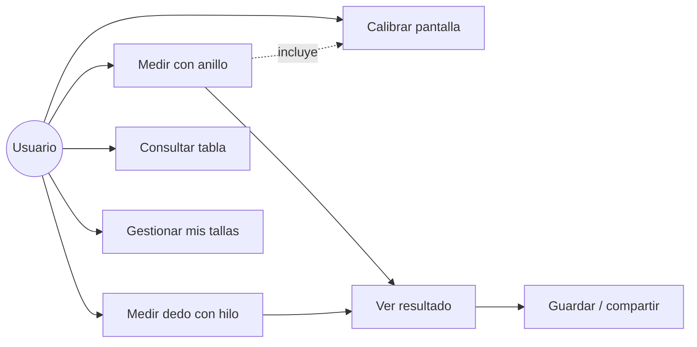

### Flujo de navegación

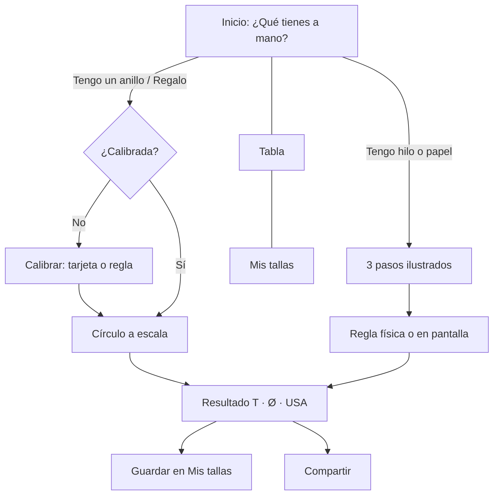

### Arquitectura

```
App (estado global + navegación integrada al historial del navegador)
├── screens/    Home · Calibrate · RingMeasure · FingerMeasure · Result · SizeTable · Saved
├── components/ Stepper · ActionBar · BottomNav · SizeReadout · CalibrationBanner · Icon
├── hooks/      useElementSize · useHoldRepeat · haptics
└── lib/        sizes (tabla + reglas) · calibration · saved · share · format   ← lógica pura y probada
```

### Modelo de datos (localStorage)

| Clave | Contenido |
| --- | --- |
| `medidor-anillos:calibracion` | `{ pxPerMm, method: "card"\|"ruler", fingerprint, date }` |
| `medidor-anillos:tallas` | `[{ id, label, mm, t, method: "ring"\|"finger", date }]` |

---

## Fase 3 · Construcción

Implementación con **React 19.3.0** sobre **Vite 8.3.3**, en componentes funcionales y hooks. No usa librerías de UI: los íconos y las ilustraciones son SVG propios.

```
medidor-anillos/
├── index.html
├── public/favicon.svg
├── src/
│   ├── main.jsx · App.jsx · index.css
│   ├── lib/          sizes.js · calibration.js · saved.js · share.js · format.js (+ *.test.js)
│   ├── hooks/        useElementSize.js · useHoldRepeat.js · haptics.js
│   ├── components/   Stepper · ActionBar · BottomNav · SizeReadout · CalibrationBanner · Icon
│   └── screens/      Home · Calibrate · RingMeasure · FingerMeasure · Result · SizeTable · Saved
├── docs/img/         capturas y mapas de thumb zone
└── .github/workflows/deploy.yml
```

Decisiones de implementación pensadas en el usuario:

- **Ajuste fino y grueso:** los botones −/+ repiten la acción si se mantienen presionados (`useHoldRepeat`), el slider sirve para cambios grandes y "Talla menor/mayor" salta directo entre tallas de la tabla.
- **Vibración háptica** (Android) cada vez que la medida cruza a otra talla. Se *siente* el cambio sin mirar.
- **Botón "atrás" del celular:** la navegación usa `history.pushState`, así el gesto atrás de Android/iOS funciona como se espera y no se pierde la medida al volver.
- **Calibración inteligente:** se pide solo la primera vez, con opción de omitirla, y avisa si cambió el zoom.
- **Recomendación explicada:** no solo dice "T18", también dice *por qué*.
- **Deshacer** al eliminar una talla guardada, en vez de un diálogo de confirmación.
- **Rendimiento:** unos 80 kB gzip, sin peticiones de red.

---

## Thumb Zone: dónde va cada elemento y por qué

La *thumb zone* (Steven Hoober, 2013) describe qué partes de la pantalla alcanza cómodamente el pulgar cuando el celular se sostiene con una mano. Cerca del 49 % de las personas lo usa así.

- 🟢 **Natural:** mitad inferior y centro. Aquí van **todas las acciones**.
- 🟡 **Estirar:** zona media y esquina inferior pegada a la palma. Aquí van acciones secundarias.
- 🔴 **Difícil:** parte superior. Aquí va **solo información para leer**, nunca botones importantes.

En esta app la regla se cumple de forma literal: **la mitad superior es para ver o medir y la inferior es para tocar.** Además hay una razón técnica: el anillo o la tarjeta se apoyan *encima* de la pantalla. Si hubiera botones en esa zona, el objeto los taparía o los activaría por accidente.

| Pantalla | Mapa | Explicación |
| :---: | :---: | --- |
|  | 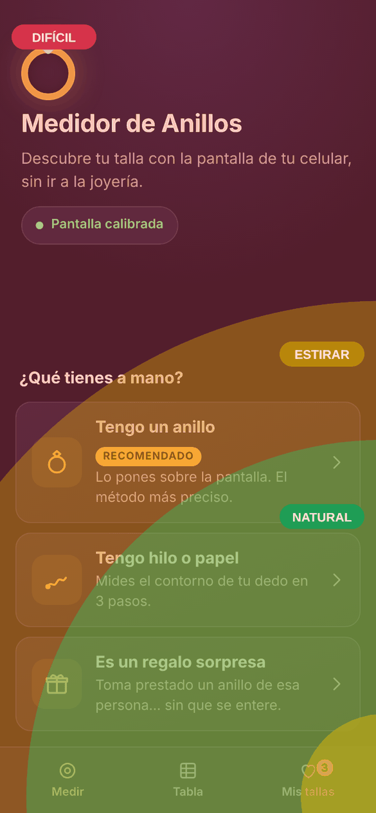 | **Inicio:** el título y el estado de calibración (información) van arriba. Las 3 opciones grandes ("¿Qué tienes a mano?") están **pegadas abajo**, en la zona natural. La barra de navegación inferior es estándar en iOS y Android y queda al alcance del pulgar. |
| 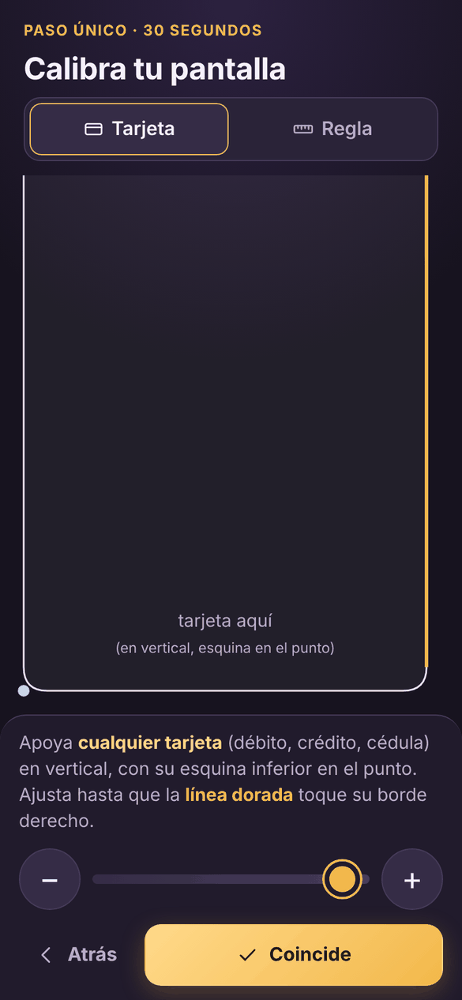 | 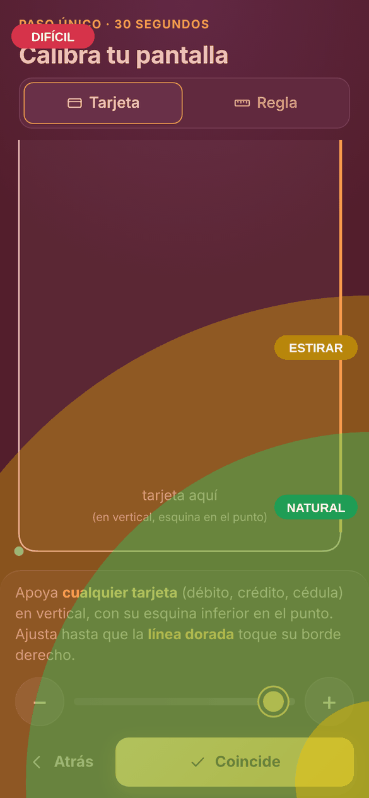 | **Calibración:** la esquina de la tarjeta se apoya **abajo** y la tarjeta sobresale **hacia arriba**, sobre los textos ya leídos. Así nunca tapa los botones −/+ ni "Coincide". |
|  | 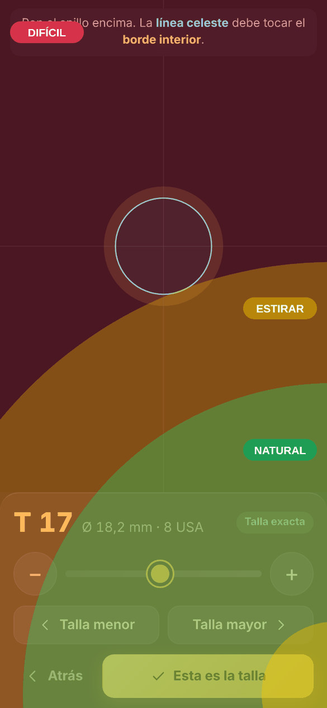 | **Medir anillo:** el círculo está en la zona superior y central, donde el pulgar no lo tapa. La lectura T/mm/USA queda justo encima de los controles para verla mientras se ajusta. −/+, el slider, Talla menor/mayor y la acción principal están en la zona verde. |
|  | 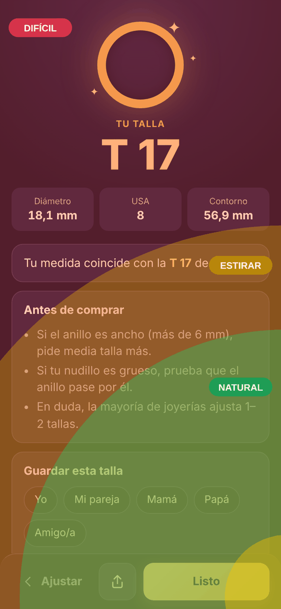 | **Resultado:** la talla grande va arriba porque es para leer. Compartir y "Listo" van en la barra inferior. "Atrás" (Ajustar) también está **abajo**: la esquina superior izquierda (donde suele ir) es la más difícil de alcanzar. |
| 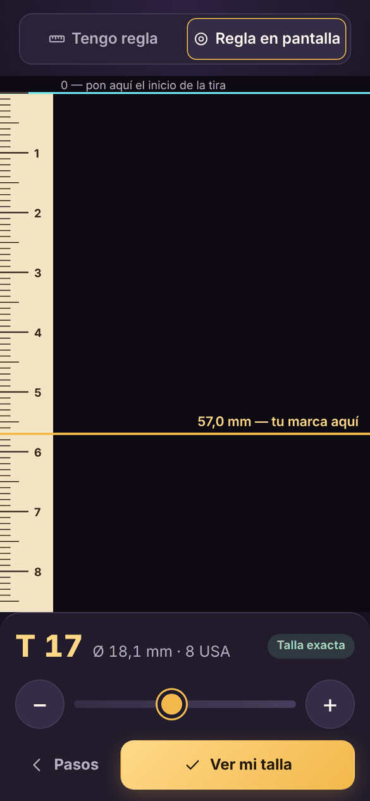 | 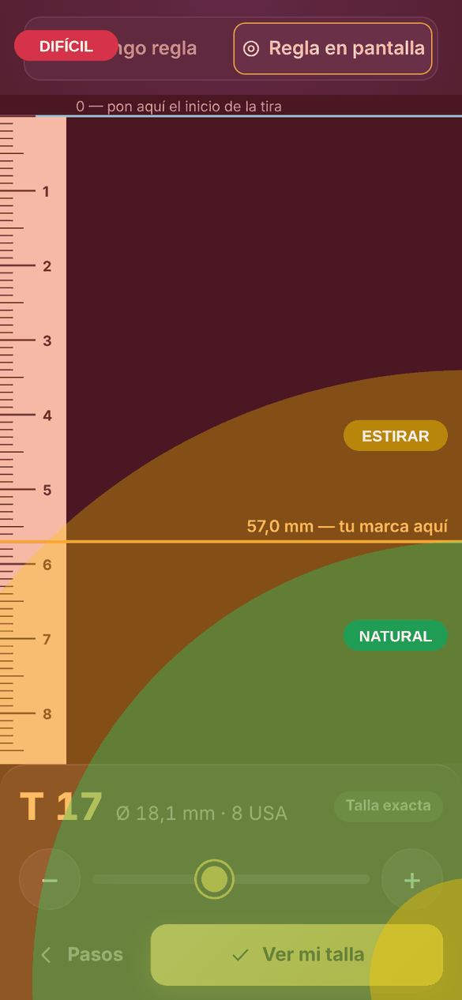 | **Regla en pantalla:** la tira se coloca sobre la regla. El marcador se mueve **con los controles de abajo**, no arrastrando sobre la regla, para no mover la tira. |
| 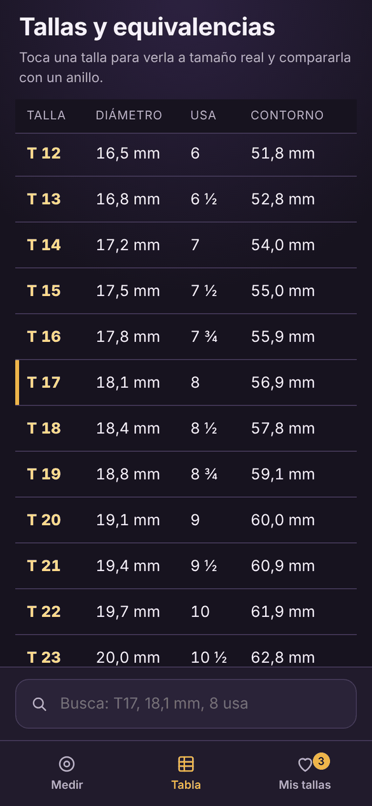 | 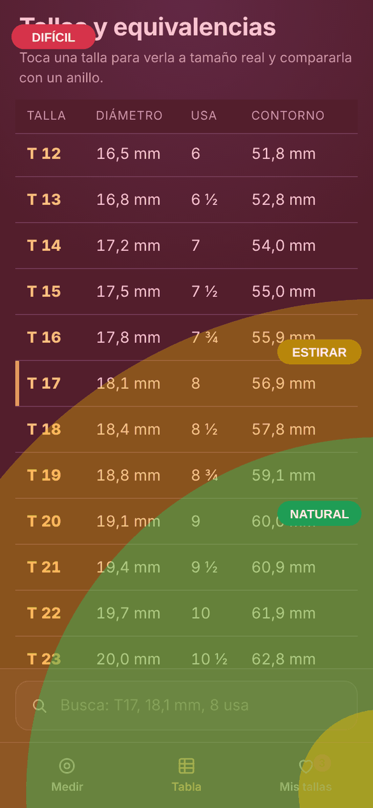 | **Tabla:** el **buscador está abajo**, junto al teclado y al pulgar, como en Safari para iOS. Al tocar una fila se ve el círculo a tamaño real. |

Otras decisiones de ergonomía:

- Botones de 52 px de alto (por encima de los 44 px de Apple y los 48 dp de Google).
- La acción principal es la más ancha y está en dorado. Solo hay una por pantalla.
- Hay *feedback* inmediato: la escala reacciona al presionar y el teléfono vibra al cambiar de talla.
- Las pantallas bajas (celular pequeño o en horizontal) se compactan con *media queries*.

---

## Fase 4 · Pruebas

### Pruebas automáticas (Vitest + Testing Library)

```bash
npm test
```

| Archivo | Tipo | Qué verifica |
| --- | --- | --- |
| `src/lib/sizes.test.js` | Unitarias | Que la tabla tenga 36 tallas crecientes y coincida con la imagen. Las conversiones C↔Ø, la recomendación (exacta, entre tallas → mayor, fuera de rango), el salto entre tallas, la búsqueda (T17, 18,1, 8 usa) y el formato con coma y fracciones |
| `src/lib/calibration.test.js` | Unitarias | Que se guarde y recupere la calibración, que se invalide al cambiar el zoom, que ignore datos corruptos y que persistan las tallas guardadas |
| `src/App.test.jsx` | Integración | Los flujos completos: hilo → resultado → guardar; anillo → pide calibrar → círculo → salto de talla; tabla → búsqueda |

**Resultado:** 24 pruebas aprobadas. Se ejecutan en cada *push* en GitHub Actions junto con el lint y el build.

### Casos de prueba manuales

| ID | Caso | Pasos | Resultado esperado |
| --- | --- | --- | --- |
| CP01 | Calibración con tarjeta | Inicio → Tengo un anillo → apoyar tarjeta → ajustar → Coincide | El chip del inicio pasa a "Pantalla calibrada" |
| CP02 | Precisión con anillo conocido | Poner un anillo de talla conocida y ajustar el círculo | La talla mostrada coincide con la real (±1 talla) |
| CP03 | Entre dos tallas | Ajustar a 18,25 mm | Muestra "Entre T17 y T18" y recomienda T18 |
| CP04 | Medición con hilo | Ingresar 57 mm de circunferencia | Ø 18,1 mm, T17, 8 USA |
| CP05 | Zoom cambiado | Calibrar, cambiar el zoom del navegador y volver | Aviso "Cambió el zoom o la pantalla" |
| CP06 | Botón atrás del celular | Medir → Resultado → gesto atrás | Vuelve al ajuste con la medida intacta |
| CP07 | Guardar y deshacer | Guardar "Mamá" → Mis tallas → eliminar → Deshacer | La talla reaparece en la misma posición |
| CP08 | Uso con una mano | Completar CP01 a CP04 sosteniendo el celular con una mano | No se necesita la segunda mano ni reacomodar el agarre |
| CP09 | Fuera de rango | Ajustar a 12 mm | Aviso "Menor que T1" |
| CP10 | Sin almacenamiento | Navegador en modo privado | La app funciona, pero no recuerda datos al cerrar |

---

## Fase 5 · Documentación e instrucciones de uso

### Instrucciones de uso

**Opción A: tengo un anillo (más preciso)**
1. Abre la app y toca **"Tengo un anillo"**.
2. **Calibra** (solo la primera vez): apoya cualquier tarjeta (débito, crédito o cédula) en vertical, con la esquina inferior en el punto celeste. Ajusta con − / + hasta que la línea dorada toque el borde derecho de la tarjeta. Toca **Coincide**. *¿No tienes tarjeta? Usa la pestaña **Regla**: el 0 en el punto y ajusta hasta los 5 cm.*
3. Pon el anillo sobre el círculo. Ajusta hasta que la **línea celeste toque justo el borde interior** del anillo. Usa "Talla menor/mayor" para ir rápido y − / + para afinar (puedes mantenerlos presionados).
4. Toca **"Esta es la talla"**.

**Opción B: tengo hilo o papel**
1. Toca **"Tengo hilo o papel"** y sigue los 3 pasos: corta una tira, rodea la base del dedo y marca donde se cruza.
2. Mide la tira con una regla y escribe el valor con − / +. También puedes elegir **"Regla en pantalla"**, poner la tira desde la línea 0 y mover la marca dorada hasta tu marca.
3. Toca **"Ver mi talla"**.

**Opción C: es un regalo sorpresa**
Toma prestado un anillo que la persona use **en el mismo dedo** y sigue la opción A. Guarda la talla con su nombre.

**En el resultado** verás la talla T, el diámetro, la talla USA y el contorno. Puedes **guardarla**, **compartirla** o abrir la **tabla**.

**Consejos para acertar**
- Mide al final del día: los dedos se hinchan un poco con el calor.
- Si el anillo que vas a comprar es ancho (más de 6 mm), sube media talla.
- Si quedas entre dos tallas, la app te recomienda la mayor.

---

## Explicación de la herramienta funcional

1. **El problema:** cada pantalla tiene una densidad distinta de píxeles, así que "100 píxeles" no son lo mismo en todos los celulares. Un círculo de 18 mm dibujado sin más quedaría de un tamaño diferente en cada teléfono.
2. **La solución, la calibración:** el usuario compara un dibujo con un objeto cuyo tamaño exacto conocemos. La tarjeta bancaria mide 53,98 × 85,60 mm por norma ISO/IEC 7810, igual en todo el mundo. Cuando la línea coincide con el borde, la app sabe cuántos píxeles equivalen a 1 mm en *esa* pantalla y lo guarda.
3. **La medición:** con esa escala, la app dibuja un círculo de diámetro exacto. El usuario lo agranda o achica hasta que coincide con el hueco del anillo, y así obtiene el diámetro interior en mm.
4. **La conversión:** el diámetro se busca en la tabla *Tallas y equivalencias* (T1 = 13 mm … T36 = 24,2 mm). Si coincide (±0,1 mm) es la talla exacta. Si cae entre dos, se recomienda la mayor. En la medición con hilo se usa primero Ø = C / π.
5. **El resultado:** muestra la talla T, la talla USA y el contorno, con consejos de compra. Se puede guardar y compartir.

---

## Instalación y desarrollo

Requisitos: **Node.js 20.19 o superior** (recomendado 22).

```bash
git clone https://github.com/SneatX/medidor-anillos.git
cd medidor-anillos
npm install
npm run dev        # servidor de desarrollo → http://localhost:5173
npm test           # pruebas automáticas
npm run lint       # linter
npm run build      # build de producción en dist/
npm run preview    # sirve el build
```

**Para probar en el celular durante el desarrollo:** ejecuta `npm run dev -- --host` y abre la IP que muestra la consola, con el celular en la misma red Wi‑Fi.

**Despliegue:** cada *push* a `main` ejecuta lint, pruebas y build, y publica en GitHub Pages (`.github/workflows/deploy.yml`).
